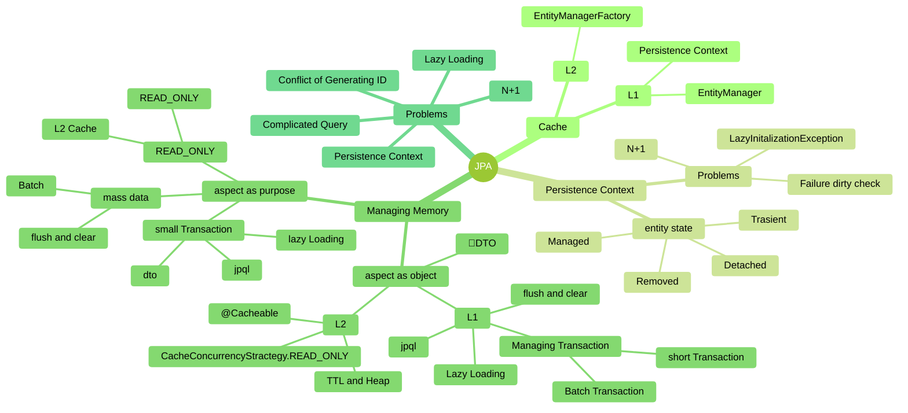

```mermaid
%%{init: {'theme': 'forest'}}%%
mindmap
  root((JPA))
    Cache
        L1
            Persistence Context
            EntityManager
        L2
            EntityManagerFactory
    Persistence Context
        entity state
            Trasient
            Managed
            Detached
            Removed
        Problems
            LazyInitalizationException
            N+1
            Failure dirty check
    Managing Memory
        aspect as object
            L1
                Lazy Loading
                jpql
                flush and clear
                Managing Transaction
                    short Transaction
                    Batch Transaction
            L2
                @Cacheable
                TTL and Heap
                CacheConcurrencyStractegy.READ_ONLY
	        DTO
        aspect as purpose
            small Transaction
                lazy Loading
                jpql
                dto
            mass data
                Batch
                flush and clear
            READ_ONLY
                L2 Cache
                READ_ONLY
    Problems
        N+1
        Lazy Loading
        Complicated Query
        Conflict of Generating ID
        Persistence Context
```

