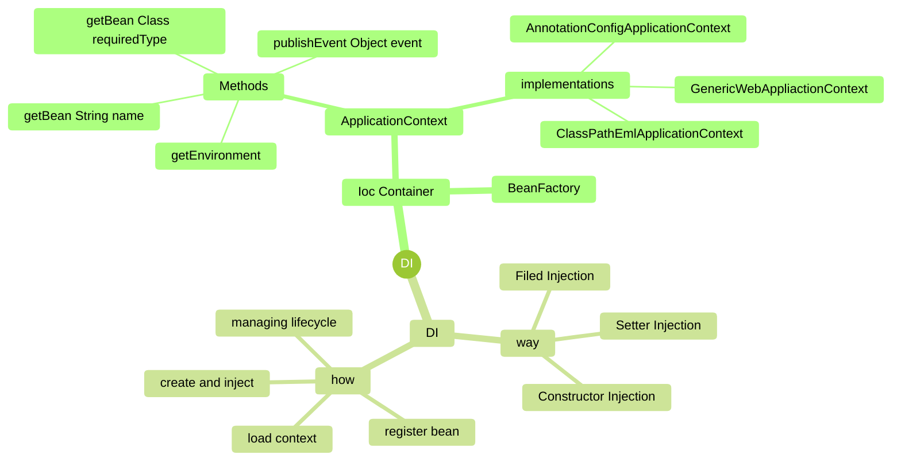

```mermaid
%%{init: {'theme': 'forest'}}%%
mindmap
  root((DI))
	  Ioc Container
		  ApplicationContext
			  Methods
				  getBean String name
				  getBean Class<T> requiredType
				  publishEvent Object event
				  getEnvironment
			  implementations
				  AnnotationConfigApplicationContext
				  ClassPathEmlApplicationContext
				  GenericWebAppliactionContext
		  BeanFactory
	  DI
		  way
			  Filed Injection
			  Constructor Injection
			  Setter Injection
		  how
			  load context
			  register bean
			  create and inject
			  managing lifecycle
```

