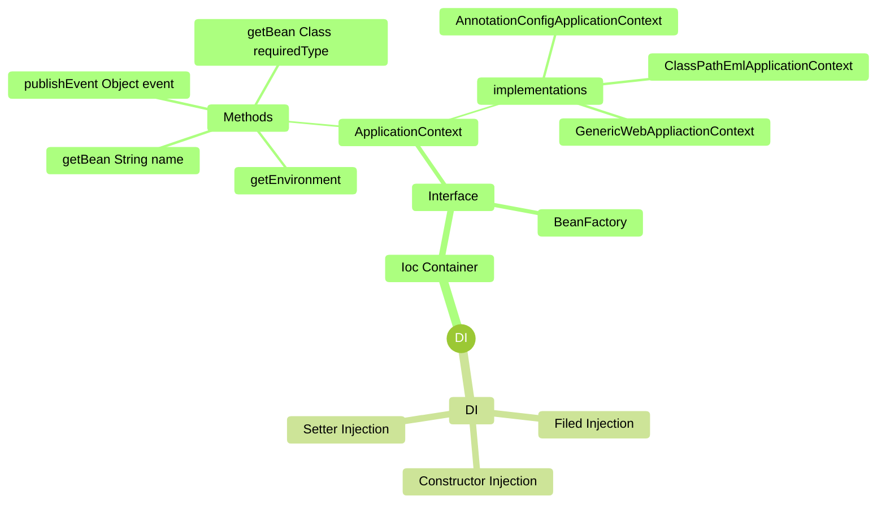

```mermaid
%%{init: {'theme': 'forest'}}%%
mindmap
  root((DI))
	  Ioc Container
		  Interface
			  ApplicationContext
				  Methods
					  getBean String name
					  getBean Class<T> requiredType
					  publishEvent Object event
					  getEnvironment
				  implementations
					  AnnotationConfigApplicationContext
					  ClassPathEmlApplicationContext
					  GenericWebAppliactionContext
			  BeanFactory
	  DI
		  Filed Injection
		  Constructor Injection
		  Setter Injection
	  
	
	  
```

