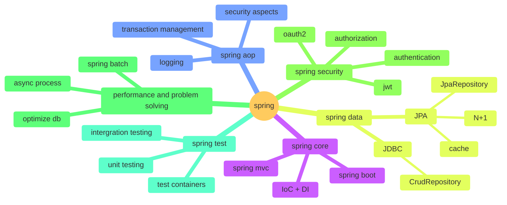

**'스프링을 잘한다'**는 단순히 Spring Framework의 사용법을 아는 것을 넘어, Spring을 활용하여 효율적이고 유지보수 가능한 애플리케이션을 설계하고 구현할 수 있는 능력을 의미합니다. 이를 세부적으로 정의하면 다음과 같습니다.

---

## 1. **기본 원리와 철학에 대한 이해**
- **IoC (Inversion of Control)**와 **DI (Dependency Injection)**의 본질적인 역할과 목적을 이해.
- Spring의 설계 철학(모듈화, 확장성, 유연성 등)을 체득하고 이를 설계에 반영.

---

## 2. **Spring의 핵심 기능 숙련**
- **Spring Core**
  - 빈(Bean) 생명주기, 스코프 관리, 의존성 주입의 다양한 방식(@Autowired, @Qualifier 등)에 대한 깊은 이해.
- **Spring AOP**
  - 횡단 관심사(Cross-cutting Concerns)를 적절히 분리하고, AOP의 사용처를 명확히 이해.
- **Spring Data**
  - JPA, MyBatis, JDBC 등 데이터 접근 계층에서의 효율적인 활용.
- **Spring MVC**
  - 웹 애플리케이션 개발에서 컨트롤러, 요청 처리, 응답 생성에 대한 숙련.
- **Spring Boot**
  - 애플리케이션 부트스트래핑, 자동 설정, Actuator와 같은 유틸리티 활용.

---

## 3. **생태계와 통합 기술 활용**
- **Spring Security**
  - 인증(Authentication)과 권한 부여(Authorization)에 대한 깊은 이해와 구현 능력.
- **Spring Cloud**
  - 마이크로서비스 아키텍처에서의 Spring 도구(Sleuth, Config Server, Gateway 등) 활용.
- **Spring Batch**
  - 대량의 데이터 처리와 배치 작업에 대한 지식.

---

## 4. **성능 최적화 및 문제 해결 능력**
- **N+1 문제**와 같은 일반적인 성능 문제를 감지하고 해결.
- 캐싱(Spring Cache), 데이터베이스 최적화, 비동기 프로세스 활용.
- 로깅, 모니터링(Spring Actuator, Sleuth 등)으로 문제를 디버깅하고 해결.

---

## 5. **실무 경험**
- 다양한 도메인과 규모의 프로젝트에서 Spring을 사용해 본 경험.
- 유지보수성과 확장성을 고려한 설계 및 배포.

---

## 6. **테스트 및 품질 관리**
- Spring Test Framework를 사용하여 단위 테스트, 통합 테스트, Mocking을 효과적으로 구현.
- CI/CD 파이프라인에서 Spring 애플리케이션을 테스트 및 배포.

---

## 7. **Spring의 한계와 적절한 사용**
- Spring을 과도하게 사용하지 않고, 필요한 곳에만 적절히 활용하는 능력.
- 대안 기술(Node.js, Quarkus 등)과의 비교를 통해 적절한 선택을 할 수 있는 판단력.

---

## 8. **최신 트렌드 파악**
- Spring의 최신 릴리스 노트와 변화 사항(Spring 6, Spring Boot 3 등)에 대한 지속적인 학습.
- 새로운 기술(SPRING Native, GraalVM 등)의 활용 가능성을 모색.

---

**결론**: '스프링을 잘한다'는 기술적인 숙련뿐 아니라, 철학과 원리를 이해하고, 이를 실제 프로젝트와 문제 해결 과정에 적용할 수 있는 능력을 의미합니다. 단순한 사용자가 아닌 설계자와 최적화 전문가로서의 역량이 포함됩니다.
